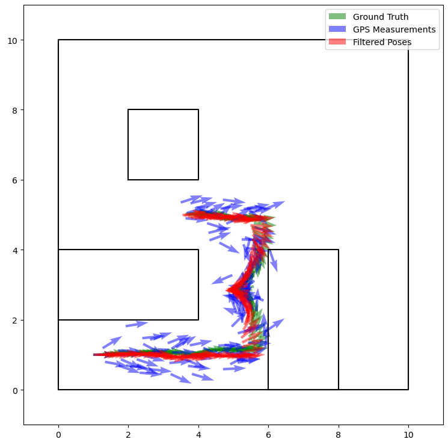
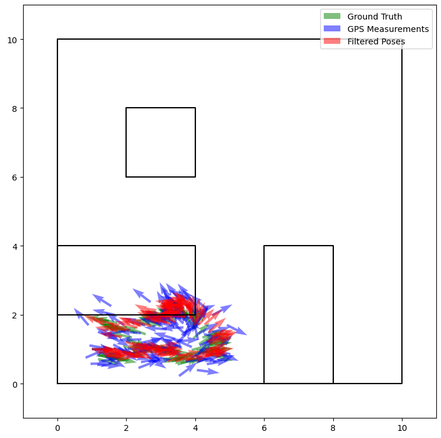
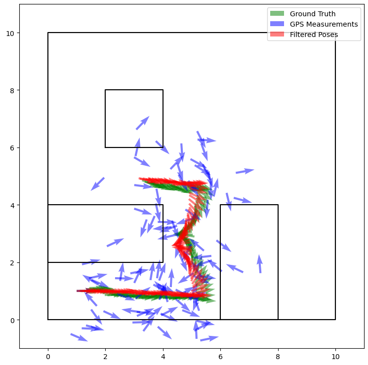
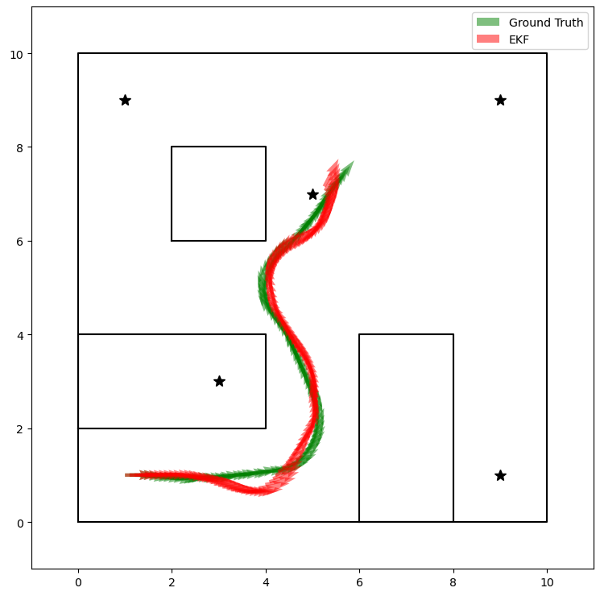
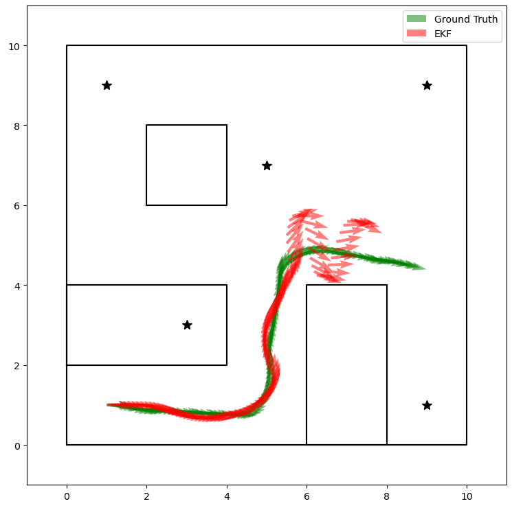
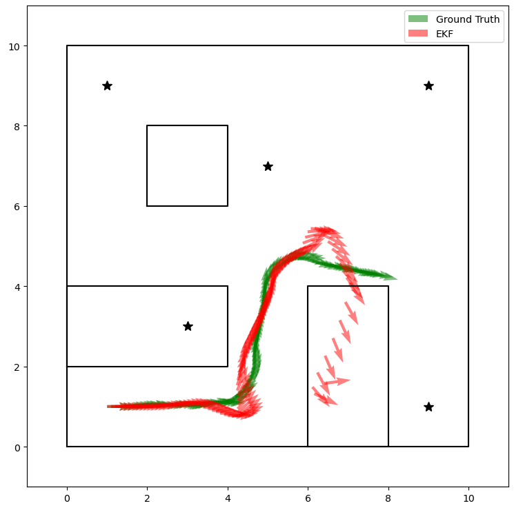
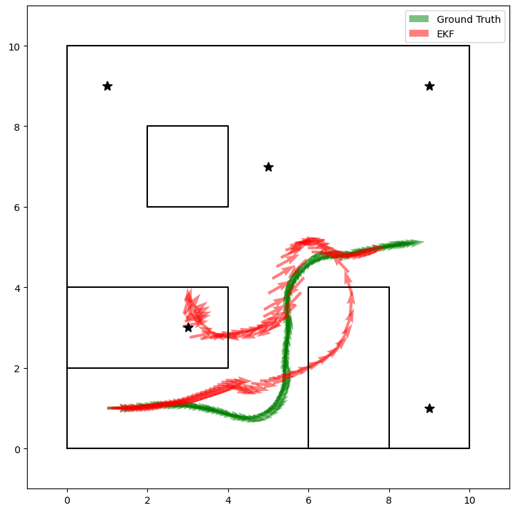

# probo_simulator
A simulator for ProbRobo completely from scratch

## Setup

Clone this repo to your computer.

Create a virtual environment in the root directory of the repo. Activate it, then install requirements with `pip install -r requirements.txt`. This project optionally uses `pip-tools` for package management.

You can run any of the demo scripts in the [`/demos`](/demos) folder to see the simulator in action. Make sure to run the scripts from within the virtual environment.

|Demo|Description|
|-|-|
|[kalman_filter_demo.py](demos/kalman_filter_demo.py)|A demonstration of the linear kalman filter class.|
|[ekf.py](demos/ekf.py)|An implementation of the non-linear extended kalman filter. The logic in this file will be moved to the `ExtendedKalmanFilter` class and this file will become just a demo then.|
|[sim_and_viz_demo.py](demos/sim_and_viz_demo.py)|A demonstration of the simulator, differential and holonomic drive robots, a few sensors, and the visualizer.|

## Kalman Filtering

### "Normal" Linear Kalman Filtering

This plot shows the behavior of a linear kalman filter. The ground truth and filtered poses are quite close, even though there is noise in the control signal and the measurements. 

This plot shows the behavior of a linear kalman filter under high process variance. This means that there is a lot of noise that is unmodeled in the kinematics of the system. The control commands were the same as in the first plot, but because of the high process noise, the robot went completely off course and crashed into the wall. Even in this case, the filtered poses closely match the ground truth. 

This plot shows the behavior of a linear kalman filter under high measurement variance. This means that there is less certainty in the measurement values, which can be seen in how spread out the GPS measurements are. Again, even in this case, the filtered poses closely match the ground truth, although with more noise, they don't match quite as closely.

### Extended Kalman Filter

This plot shows the typical behavior of an extended kalman filter. The robot is using the measured bearing and range of the landmarks (stars) to localize. While the filtered poses drift a bit, they generally stay fairly close to the ground truth. That said, my EKF is currently exibiting some undesirable behavior in some cases:

In these cases, the filtered poses start drifting away from the ground truth significantly at the end of the path. Cases like these are somewhat common.

Sometimes, the filter behaves even more unexpected, and drift towards the start or even completely lose the path. Cases like these are rare, but can occur.

### Next Steps

There are many things I would like to continue building for kalman filtering in this simulation environement. 

I beleive the EKF needs some debugging. Once I've fixed any issues, I would like to clean up the EKF code and create a generic class for it. I would also like this class to be strictly typed like the rest of the simulator, and there are some structural changes I may make to the rest of the simulator that I think will make this easier. When typing the EKF, I might do the same for the linear kalman filter as well.

I would also like to work on plotting more. I would like to be able to more clearly plot paths, as well as their uncertainty. It would also be nice to be able to show things like error, uncertainty, and internal parameter values over time, which may be better visualized in a non-spatial visualization. I also want to make animations from this

While it is a bit outside the scope of kalman filtering, I would also love to make a live, interactive simulation environment. If I did, it would be really cool to implement kalman filtering live as you interact with the sim.
