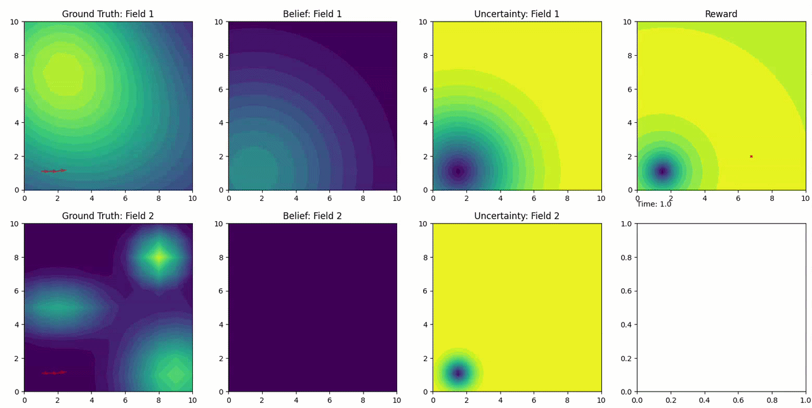
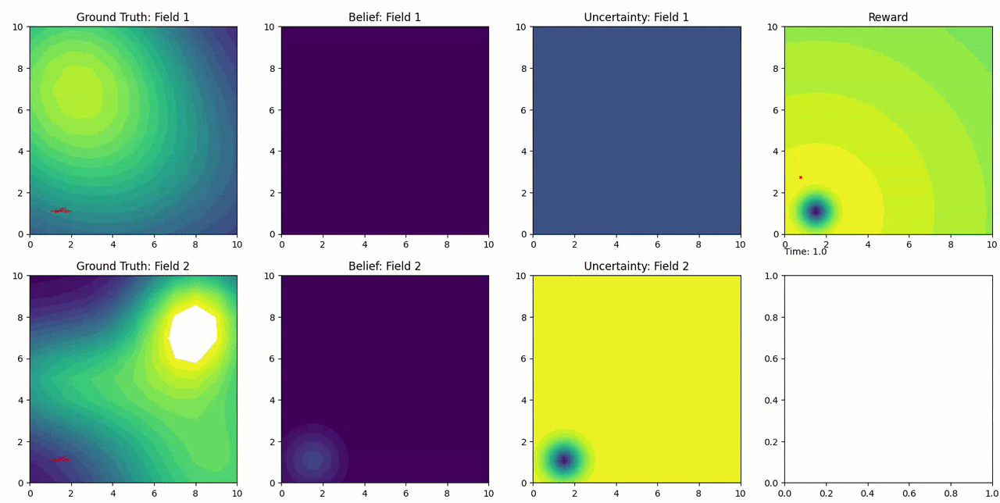

# probo_simulator
A simulator for ProbRobo completely from scratch

## Setup

Clone this repo to your computer.

Create a virtual environment in the root directory of the repo. Activate it, then install requirements with `pip install -r requirements.txt`. This project optionally uses `pip-tools` for package management.

You can run any of the demo scripts in the [`/demos`](/demos) folder to see the simulator in action. Make sure to run the scripts from within the virtual environment.

|Demo|Description|
|-|-|
|[`kalman_filter_demo.py`](demos/kalman_filter_demo.py)|A demonstration of the linear kalman filter class.|
|[`ekf.py`](demos/ekf.py)|An implementation of the non-linear extended kalman filter. The logic in this file will be moved to the `ExtendedKalmanFilter` class and this file will become just a demo then.|
|[`sim_and_viz_demo.py`](demos/sim_and_viz_demo.py)|A demonstration of the simulator, differential and holonomic drive robots, a few sensors, and the visualizer.|
|[`graph_slam_demo.py`](demos/graph_slam_demo.py)|A demonstration of GraphSLAM in a customizable environment.|

## Multi-task planning

This branch of the simulator is to explore multi-task planning. There are two main files to run: [`multi_field.py`](demos/multi_field.py) and [`sequential_fields.py`](demos/sequential_fields.py)

The multi field file explores syncronous multi-task planning. It uses a single reward function for UCB-based value field maximum-seek-and-sample tasks. Instead of the reward function being just the sum of one field's mean and scaled standard deviation, both UCBs are summed into one reward function. There is also a distance factor that aims to make the robot explore closer to itself, since the current path planning algorithm just aims directly for where the robot thinks the maximum of the reward function is. This helps prevent rapid oscillation between two locally maximal points that the robot slowly gains information about.

One issue with this implementation is that, with only one reward function, you can't really have multiple goals. This means that, while the robot becomes very certain about the underlying value fields, it doesn't reallt have a way to visit both maxima. Making this work would likely need a state machine that visits them sequentially, and some way to detect which goals have been completed.

When I realized this I shifted my implementation to the sequential method. This method is essentailly identical to the single-task [`mss_pomdp.py`](demos/mss_pomdp.py) file that both of the multi-task files are based on, except with another value field and reward function. It also includes a state machine that keeps track of the order of fields to search for, and when to stop. With this solution, the robot always has a single priority, making planning simpler and more robust. Once the robot detects it's close to the maximum, it goes on to the next task, and once it completes the last task it stops. The behavior of this file doesn't seem to explore quite as efficiently as the multi-field file, but the convergence behavior is much more robust and it actually completes both goals.

Once I had gotten this working, I wanted to see if there was a difference in the time if I changed the order the tasks were completed in. It turns out there was, but it was small. 

I started by having the robot explore the field with the higher length scale first. When I did this, it completed the first task farily quickly, then took a while to gain enough confidence about the entire field for the second value field to converge to the maximum. 

When I flipped the order, it still took a while to complete the task for the field with the short length scale, but one it was done with that, it could immeditely go to the maximum of the other field since it had built up plenty of confidence, so this method ended up being slightly faster.

