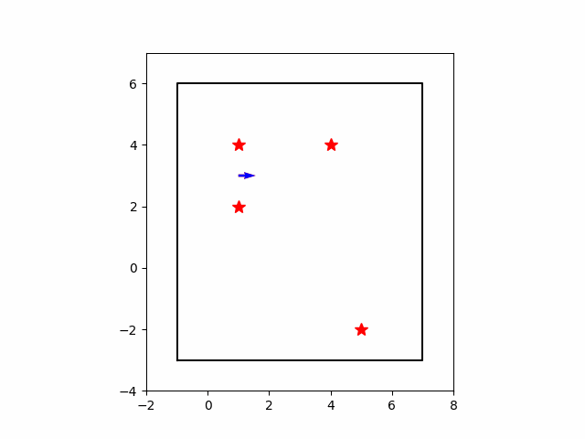

# probo_simulator
A simulator for ProbRobo completely from scratch

## Setup

Clone this repo to your computer.

Create a virtual environment in the root directory of the repo. Activate it, then install requirements with `pip install -r requirements.txt`. This project optionally uses `pip-tools` for package management.

You can run any of the demo scripts in the [`/demos`](/demos) folder to see the simulator in action. Make sure to run the scripts from within the virtual environment.

|Demo|Description|
|-|-|
|[`kalman_filter_demo.py`](demos/kalman_filter_demo.py)|A demonstration of the linear kalman filter class.|
|[`ekf.py`](demos/ekf.py)|An implementation of the non-linear extended kalman filter. The logic in this file will be moved to the `ExtendedKalmanFilter` class and this file will become just a demo then.|
|[`sim_and_viz_demo.py`](demos/sim_and_viz_demo.py)|A demonstration of the simulator, differential and holonomic drive robots, a few sensors, and the visualizer.|
|[`graph_slam_demo.py`](demos/graph_slam_demo.py)|A demonstration of GraphSLAM in a customizable environment.|

## GraphSLAM

All of the implementation for GraphSLAM is in [`graph_slam.py`](src/probo_sim/graph_slam.py). The primary demo for the GraphSLAM implementation, which lets you play around with the environment and different parameters, is  [`graph_slam_demo.py`](demos/graph_slam_demo.py). Animations like the ones below can be created with [`graph_slam_gif.py`](demos/graph_slam_gif.py).

### GraphSLAM Implementation in action:

Red represents the ground truth and blue represents the estimates. The arrows are successive robot poses and the stars are landmarks.

Notice how, once the robot gets back into the range of the first landmarks it sees, a loop closure is formed, which bends the entire graph into a much more accurate estimate.